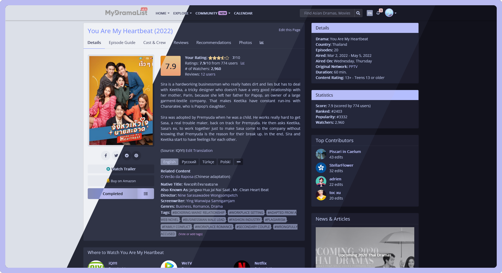
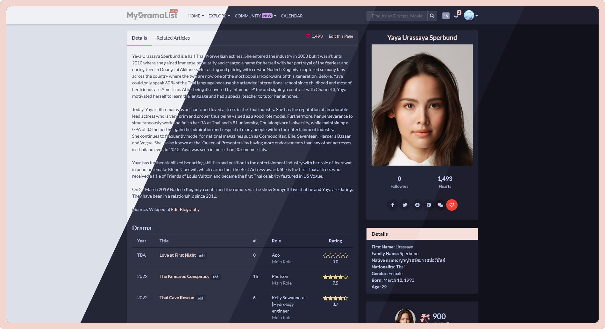
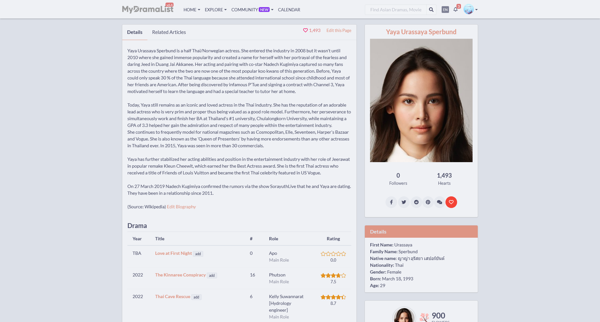
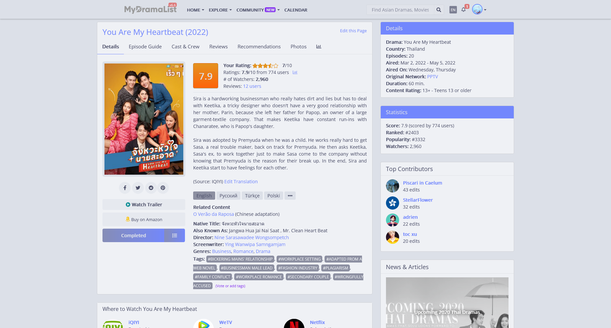
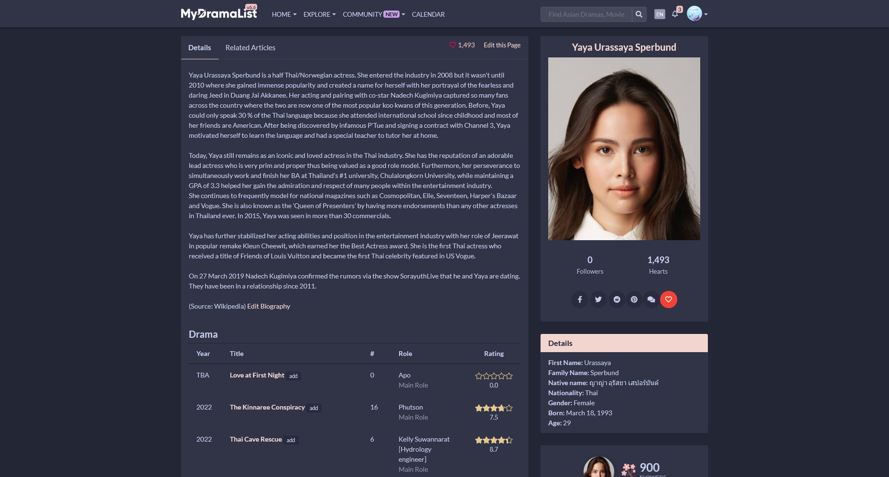
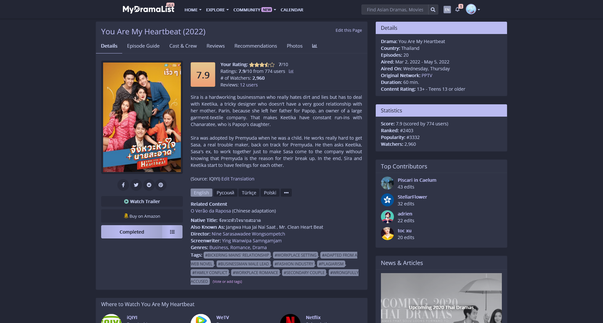
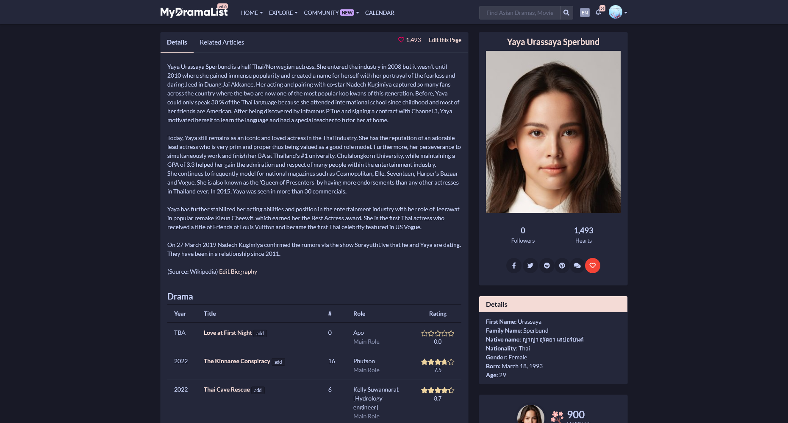
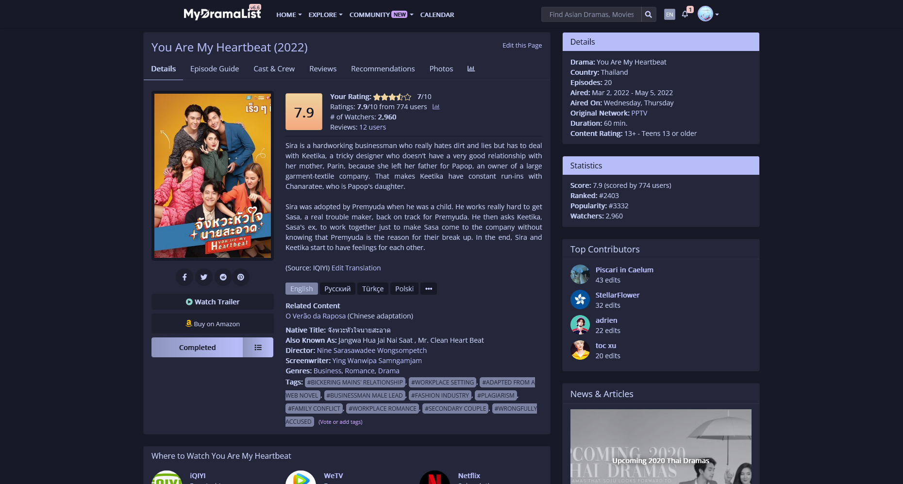
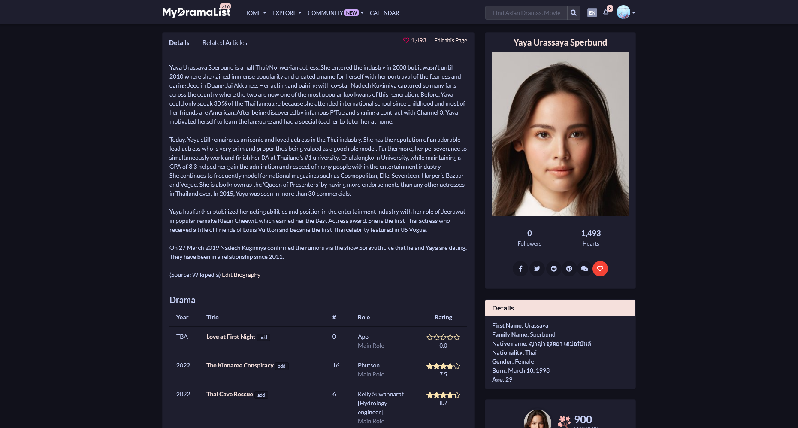
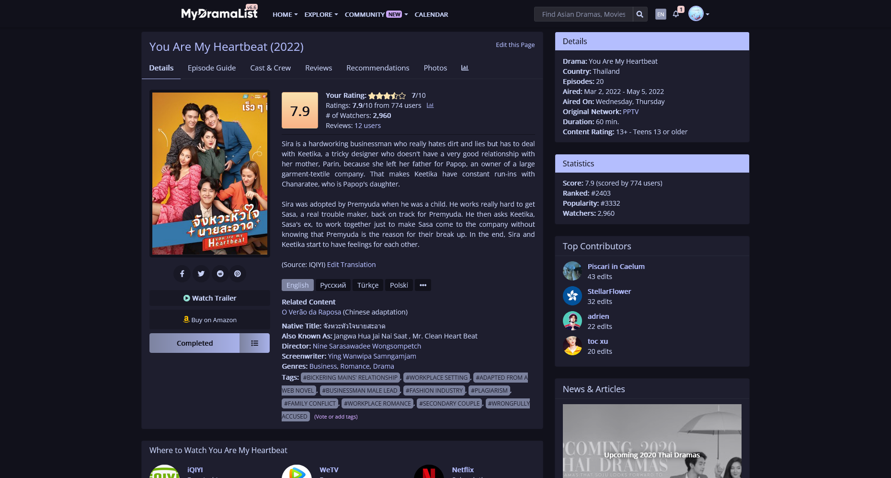

<h3 align="center">
	 
	
	Catppuccin for <a href="https://github.com/catppuccin/mydramalist">MyDramaList</a>
	
</h3>

<!-- 

	
	
	

 -->

	
	
	

	 

## Previews

🌻 Latte

<h3>Original</h3>

<h3>Modernized</h3>

🪴 Frappé

<h3>Original</h3>

<h3>Modernized</h3>

🌺 Macchiato

<h3>Original</h3>

<h3>Modernized</h3>

🌿 Mocha

<h3>Original</h3>

<h3>Modernized</h3>

## Usage

1. Install the [Stylus](https://github.com/openstyles/stylus) extension for your browser
2. [Click on the theme](https://github.com/dear-clouds/mydramalist/raw/main/src/MDLCatpuccin.user.css) to install it
3. Choose your favorite flavour, accent and version with the dropdown options
4. Change the theme anytime via the Stylus extension!

<!-- ## 🙋 FAQ (optional)

-	Q: **_"Where can I ask for help?"_**\
	A: You contact me directly on MDL -->

## 💝 Thanks to

- [Mio.](https://github.com/dear-clouds)

&nbsp;

	

	Copyright &copy; 2021-present <a href="https://github.com/catppuccin" target="_blank">Catppuccin Org</a>

	

